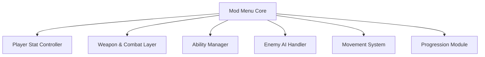

## Overview

The Abyssus Mod Menu is a runtime gameplay control system built to expose and manipulate the core mechanics of combat-heavy roguelike sessions. It interfaces directly with player attributes, weapon behavior, enemy logic, resource flow, and progression triggers without modifying original game files. Each feature is isolated into a dedicated module, allowing selective activation and real-time tuning. The system is designed for sandbox testing, difficulty adjustment, mechanical analysis, and custom run configuration.

---

## Player Health and Survival Systems

* Infinite health toggle
* Damage immunity
* Health value locking
* Environmental damage disable

**In-game behavior:**
Overrides incoming damage calculations and hazard checks during combat and movement updates.

---

## Weapon and Combat Control Layer

* Damage multiplier
* One-hit elimination
* Fire rate scaling
* Recoil and spread control

**Feature intent:**
Hooks into weapon stat tables and hit resolution logic to enforce custom combat output behavior.

---

## Ability, Energy, and Cooldown Management

* Unlimited ability energy
* Cooldown bypass
* Instant skill recharge
* Ability charge locking

**In-game behavior:**
Intercepts ability cost validation and cooldown timers before execution.

---

## Enemy AI and Encounter Manipulation

* Enemy freeze toggle
* Aggro disable
* Global enemy slow
* AI reaction delay

**Feature intent:**
Modifies enemy update loops and decision timing to reduce or nullify hostile behavior.

---

## Movement and Physics Overrides

* Player speed multiplier
* No inertia movement
* Gravity scaling
* Free movement mode

**In-game behavior:**
Adjusts physics parameters and movement constraints applied by the engine’s locomotion system.

---

## Resource and Economy Control

* Infinite currency
* Resource gain multiplier
* No resource consumption
* Pickup auto-collect

**Feature intent:**
Alters inventory and transaction handlers during pickup, spend, and reward events.

---

## Progression and Run State Tools

* Experience multiplier
* Instant level-up
* Unlock all perks
* Progression freeze

**In-game behavior:**
Intercepts progression triggers and perk allocation logic during run advancement.

---

## System Architecture Diagram

---

## FAQ

**Does the mod menu modify game files?**
No, all functionality operates through runtime memory control.

**Can features be toggled mid-run?**
Yes, most options support real-time activation and adjustment.

**Does it work during boss encounters?**
Combat and AI features apply to regular enemies and bosses.

**Are progression changes permanent?**
Run-based progression persists according to save logic unless manually reverted.

**Can multiple features run simultaneously?**
All modules are designed to function independently and concurrently.

**Does movement override break scripted events?**
Scripted sequences generally remain intact, though constraints may be bypassed.

---

## Feature Summary

* Health and damage control systems
* Weapon and combat parameter editing
* Ability energy and cooldown management
* Enemy AI behavior manipulation
* Movement and physics overrides
* Resource and economy control
* Progression and run-state management
